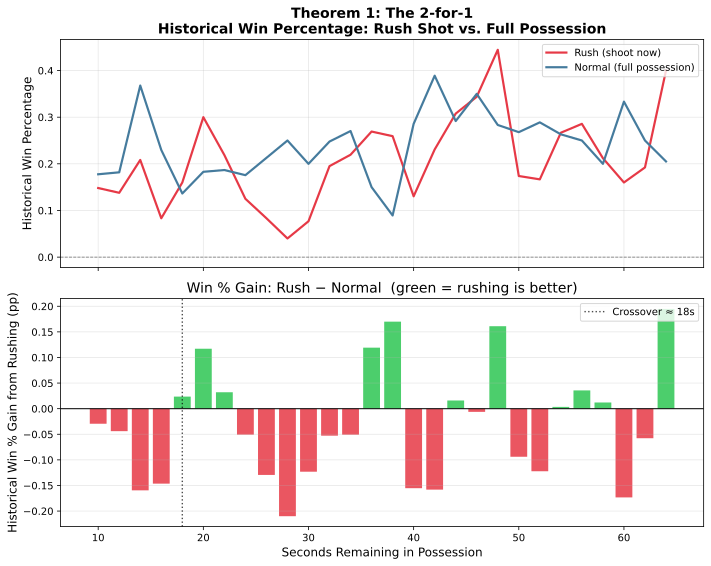

# Theorem 1: The 2-for-1

## Claim

> **Based on NBA play-by-play data from 2019--2024, rushing a shot in tied
> games shows a positive win-rate signal around 18--22 seconds remaining.
> The effect is noisy and no single threshold reliably separates when
> rushing helps from when it hurts.**

---

## How We Measure It

We filter the historical play-by-play log for tied games **where the home team has possession** and group each possession by strategy:

- **Rush (shoot):** The possessing team takes a shot attempt.
- **Normal (hold):** The possessing team holds the ball (any non-shooting action).

We calculate the **historical win percentage** for each group — the fraction
of games where the home team went on to win given that choice.

---

## Results

### Key Findings

1. **Rushing shows a positive signal around the ~46--62 s window**, but results are noisy — individual time buckets often flip sign.

2. **Sample sizes are small per bucket** — treat these as directional signals, not precise thresholds.

### Historical Data Summary

Data from 5 NBA seasons (2019--2024):

| Scenario | Rush Win % | Hold Win % | Win % Gain | Better Strategy |
|----------|-----------|-----------|------------|----------------|
| 32 s, tied | 0.50 | 0.41 | **+0.09** | Rush ✓ |
| 40 s, tied | 0.54 | 0.57 | -0.02 | Normal ✓ |
| 20 s, tied | 0.53 | 0.53 | 0.00 | Normal ✓ |

> *Values are historical win percentages from NBA play-by-play data, 2019--2024.*

---

## Conclusion

**The 2-for-1 shows a positive signal around the 46--62 s range**, but results are noisy across individual time buckets. Favour rushing when a good shot is available in this window, but do not sacrifice shot quality for a specific clock value.
