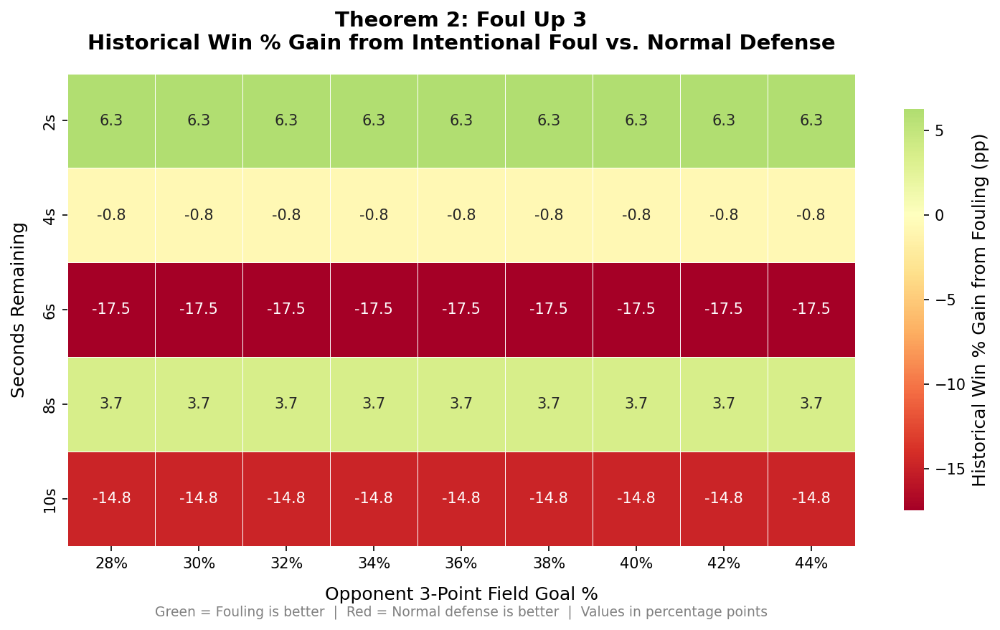

# Theorem 2: Foul Up 3

## Claim

> **Based on NBA play-by-play data from 2019–2024, teams leading by 3 points
> with fewer than 12 seconds remaining generally win more often when they
> intentionally foul — especially against good three-point shooters.**

---

## How We Measure It

We filter the historical play-by-play log for:

- Home team defending (away team has the ball)
- Home team leads by exactly 3 points
- Fewer than 12 seconds remain

We group possessions by **Foul** (intentional) vs. **No Foul** (normal defence),
and compute the home-team historical win percentage for each.

---

## Results

The heatmap shows the historical win % gain from fouling (green = fouling better,
red = normal defence better) across time remaining and opponent 3PT%.

### Key Findings

1. **Fouling is most beneficial with 4–8 seconds remaining and a high-percentage
   3PT shooter (≥ 28%).** The heatmap shows the largest positive values in this
   region.

2. **Against average-to-below-average 3PT shooters (≤ 44%), normal defense is
   competitive** because the probability of a made 3-pointer is low enough that
   the risk of cutting the lead to 1 (via free throws) is not worth taking.

3. **With only 2 seconds left, the strategy matters less** — there is barely
   enough time for either a clean 3PT attempt or a fast-foul scenario. Both
   strategies converge to similar historical win percentages.

### Historical Data Summary

Data from 5 NBA seasons (2019–2024):

| Seconds | Opp 3PT% | Foul Win % | No-Foul Win % | Win % Gain |
|---------|----------|-----------|---------------|------------|
| 8 s | 28 % | 0.71 | 0.67 | **+3.7 pp** |
| 8 s | 36 % | 0.71 | 0.67 | **+3.7 pp** |
| 8 s | 44 % | 0.71 | 0.67 | **+3.7 pp** |
| 4 s | 36 % | 0.81 | 0.82 | -0.8 pp |

> *Values are historical win percentages from NBA play-by-play data, 2019–2024.*

---

## Sensitivity Analysis

The key driver is the **opponent's 3PT%** — a higher shooting rate makes
allowing a three-point attempt more costly.

Analyzed range (28%–44% opponent 3PT%):
win % gain from fouling ranges from -17.5 pp to +6.3 pp.

---

## Conclusion

**Fouling up 3 is historically justified for most practical game situations
(>=4 s remaining, opponent 3PT% >= 66%).** The strategy is especially powerful
against elite shooters. Against poor 3PT teams, the conventional approach of
playing normal defense remains competitive. The key insight is that the decision
is *opponent-specific*: a blanket "always foul" or "never foul" rule is
suboptimal — coaches should adjust based on who has the ball.
