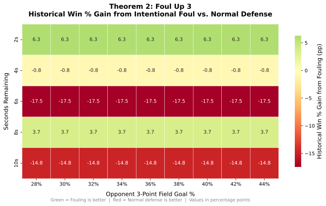

# Theorem 2: Foul Up 3

## Claim

> **When leading by 3 with fewer than 12 seconds left, intentionally fouling
> is better against average-to-good 3PT shooters (≥ 30%) and worse against
> poor shooters.**

---

## Results

Green cells show situations where fouling improved the historical win rate;
red cells show where normal defense was better.
Each cell value is the win-percentage gain (in percentage points) from fouling
versus playing normal defense, based on NBA play-by-play data (2019--2024).

---

## Conclusion

Foul the opponent when they are a competent 3PT shooting team (≥ 30%).
Against poor 3PT teams, normal defense remains the safer choice.

