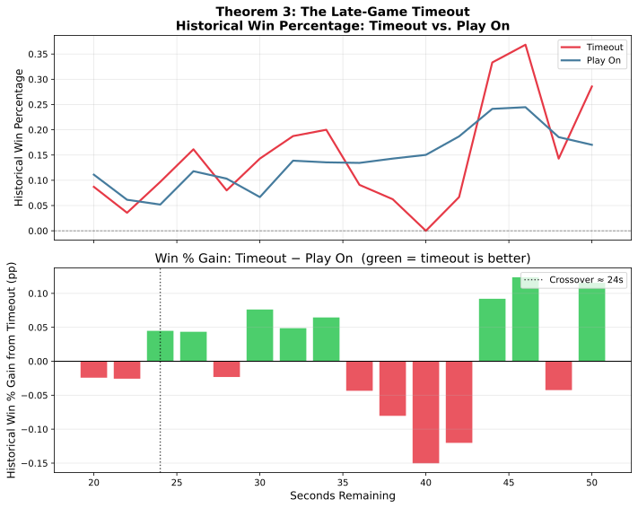

# Theorem 3: The Late-Game Timeout

## Claim

> **Based on NBA play-by-play data from 2019--2024, calling a timeout when
> trailing by 1--3 (or tied) with 36--50 seconds remaining shows a consistent
> win-rate advantage. Results are mixed below 36 seconds.**

---

## How We Measure It

We filter the historical play-by-play log for situations where:

- The home team has possession
- The score differential is between -3 and 0 (trailing by up to 3, or tied)
- Between 20 and 50 seconds remain

We group possessions by:

- **Timeout:** The team stops play with a timeout call.
- **Play On:** The team continues without calling a timeout.

We then calculate the **historical win percentage** for the home team in
each group across a sweep of time-remaining values.

---

## Results

---

## Conclusion

With 36--50 seconds remaining, calling a timeout is historically beneficial.
